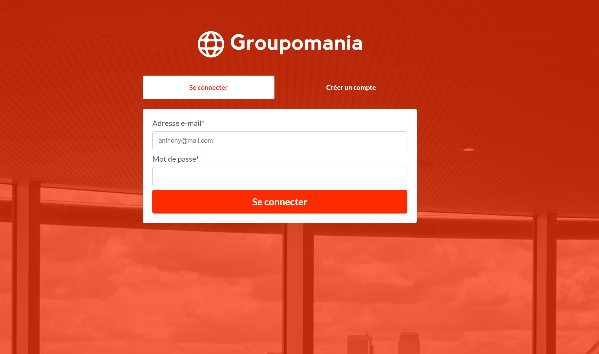

# Projet 7 Groupomania Front End

Installez les dépendances
```terminal
npm install
```
Lancer avec la commande
```terminal
ng serve
```
Ouvrir avec cette adresse 
```terminal
 http://localhost:4200/sign-in
```


# Projet 7 Groupomania Back End

Installez les dépendances
```terminal
npm install
```

Un fichier config est présent, nommé "ormconfig.json.example"
(pour vous connecter à votre base de donnée postegreSQL)


- [x] - "type" : "(renseignez votre type de bdd exemple "postgres" )"
- [x] - "username": "(renseignez votre nom d'utilisateur)",
- [x] - "password": "(renseignez votre mot de passe)",
- [x] - "host": "(renseignez votre hôte local exemple "localhost" )"
- [x] - "port": (renseignez votre port de communicatiopn exemple "5432"),
- [x] - "database": ("groupomania" nom de la base de donnée),


Une fois completer, le renommer en "ormconfig.json"

Un fichier ".env.example" est présent, 2 champs sont à remplir 
- [x] - NODE_ENV="development" 
- [x] - JWT_SECRETKEY = "(indiquer une clé de chiffrement)"

puis renommer le fichier en ".env"


Lancer avec la commande 
```terminal
npm run start.
```
